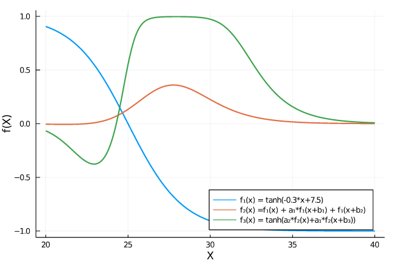
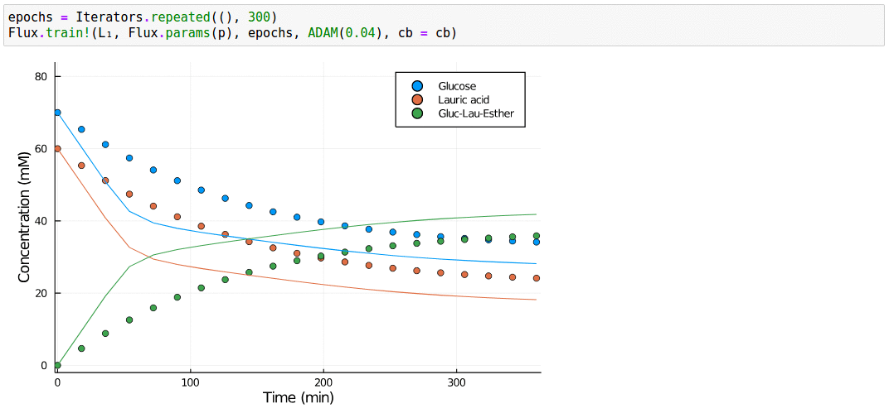
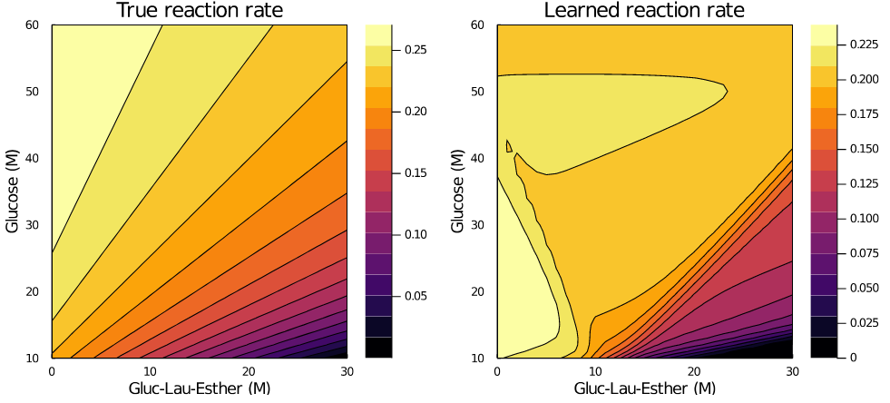

# Workshop-NeuralODE-2020
A 30 minute showcase on the how and the why of neural differential equations. 

## Content
There are three julia notebooks that show,

[Notebook 1:](./01-machine-learning.ipynb) an introduction to machine learning and neural networks,



[Notebook 2:](./02-NODEs.ipynb) learning reaction kinetics using neural differential equations (NODEs),





[Notebook 3 (WIP):](./) coupling these NODEs with reactor models.

## Installation instructions
### Installing Julia
1. Download the *Julia* binaries for your system [here](https://julialang.org/downloads/) we suggest to install the Long-term support release, v1.0.5
2. Yes, it is that simple :zap:

### Installing IJulia
Then run the Julia application
(double-click on it); a window with a `julia>` prompt will appear.  At
the prompt, type:
```julia
using Pkg
Pkg.add("IJulia")
```
to install IJulia.

This process installs a [kernel specification](https://jupyter-client.readthedocs.io/en/latest/kernels.html#kernelspecs) that tells Jupyter (or JupyterLab) etcetera
how to launch Julia.

`Pkg.add("IJulia")` does not actually install Jupyter itself.
You can install Jupyter if you want, but it can also be installed
automatically when you run `IJulia.notebook()` below.  (You
can force it to use a specific `jupyter` installation by
setting `ENV["JUPYTER"]` to the path of the `jupyter` program
before `Pkg.add`, or before running `Pkg.build("IJulia")`;
your preference is remembered on subsequent updates.

### Running the IJulia Notebook
If you are comfortable managing your own Python/Jupyter installation, you can just run `jupyter notebook` yourself in a terminal. To simplify installation, you can alternatively type the following in Julia, at the `julia>` prompt:
```julia
using IJulia
notebook()
```
to launch the IJulia notebook in your browser.

The first time you run `notebook()`, it will prompt you
for whether it should install Jupyter.  Hit enter to
have it use the [Conda.jl](https://github.com/Luthaf/Conda.jl)
package to install a minimal Python+Jupyter distribution (via
[Miniconda](http://conda.pydata.org/docs/install/quick.html)) that is
private to Julia (not in your `PATH`).
On Linux, it defaults to looking for `jupyter` in your `PATH` first,
and only asks to installs the Conda Jupyter if that fails; you can force
it to use Conda on Linux by setting `ENV["JUPYTER"]=""` during installation (see above).  (In a Debian or Ubuntu  GNU/Linux system, install the package `jupyter-client` to install the system `jupyter`.)

[source](https://raw.githubusercontent.com/JuliaLang/IJulia.jl/master/README.md)


Contact: [Bram.De.Jaegher@gmail.com](mailto:bram.de.jaegher@gmail.com)

